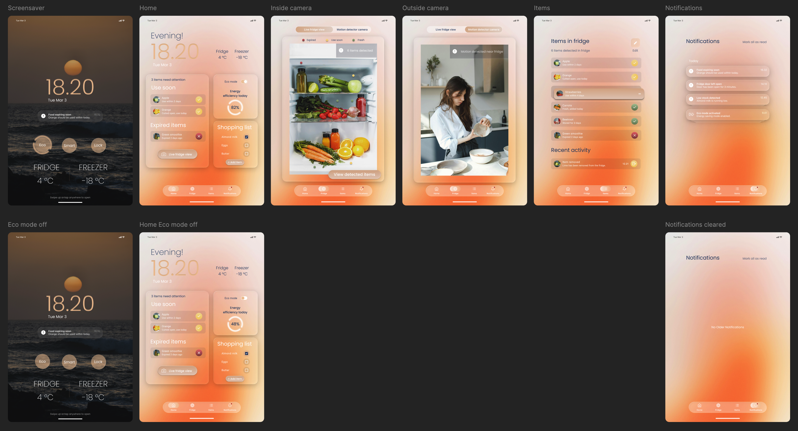
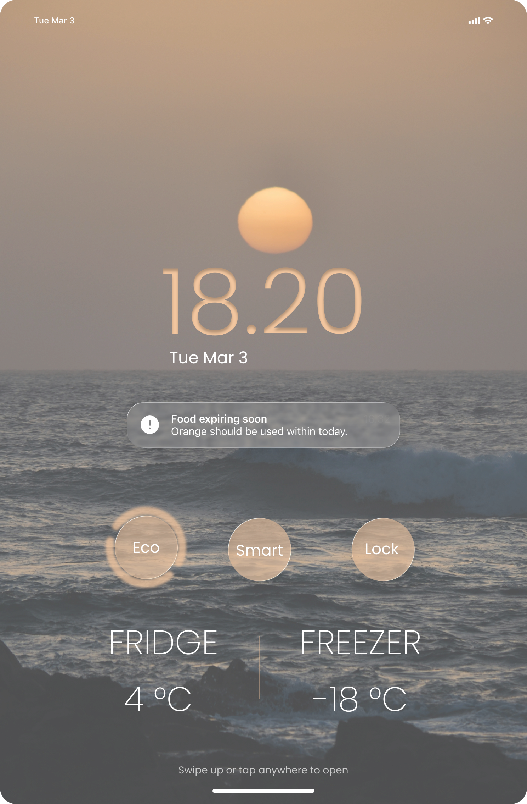
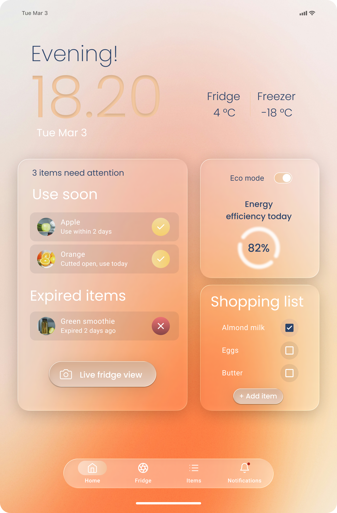
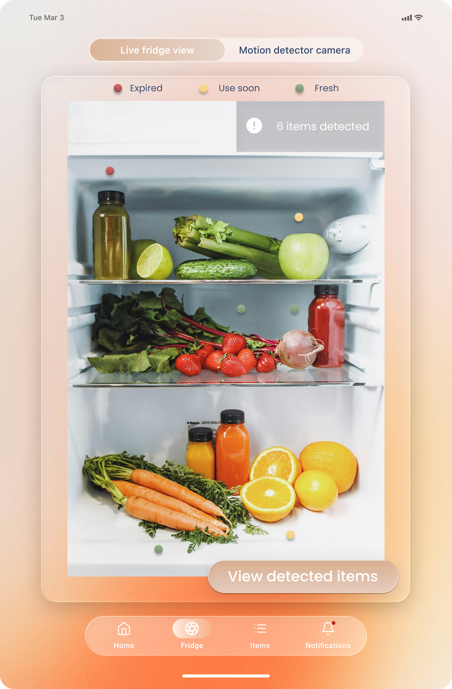
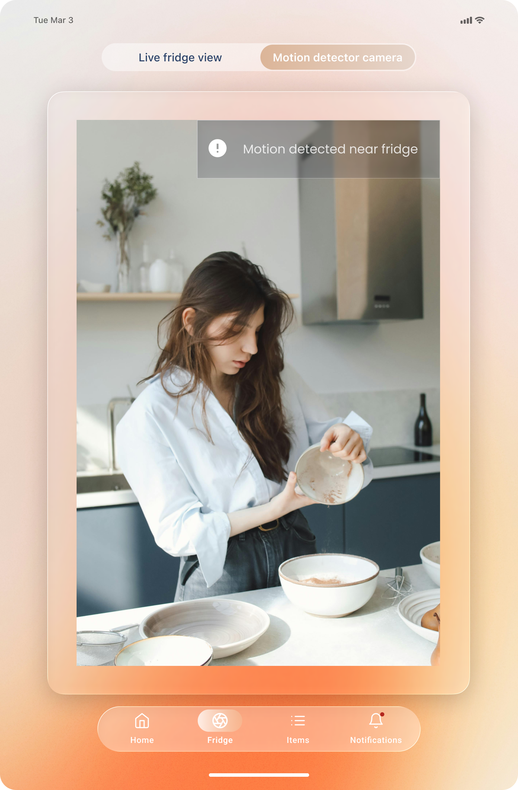
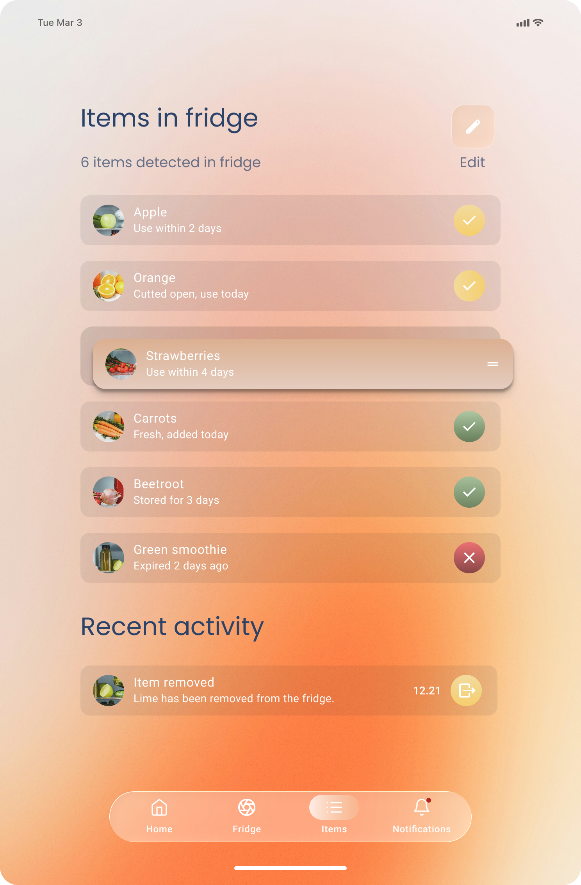
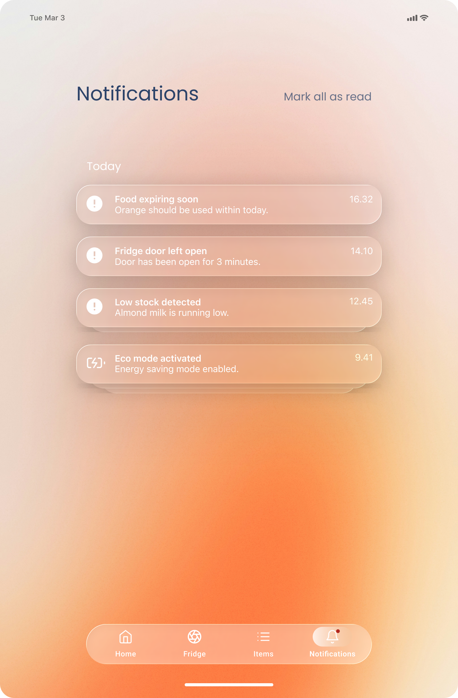

# Smart Refrigerator UI Prototype

2026

This project is a UI/UX concept for a smart refrigerator interface, created as part of a course on web publishing and usability.

The goal was to design a user interface for a 10-inch touchscreen placed on a refrigerator door. I wanted to create something that feels simple, calm, and genuinely useful in everyday life — not just a “smart feature”, but something people would actually use.

> This is a concept design and interactive prototype created in Figma.

## Overview

The idea behind this project was to explore how a smart refrigerator could make everyday life a bit easier, especially when it comes to keeping track of food and reducing waste.

I focused on designing an interface that feels clear and easy to understand at a glance, even in those moments when you’re busy, distracted, or just quickly checking something.

The design includes:
- a home view with key information  
- camera views inside and outside the fridge  
- food tracking with freshness indicators  
- notifications about important events  

The prototype includes multiple connected screens forming a complete user flow:

## My Role

💜 Designed the full interface independently as part of a course assignment  
💜 Planned the structure for a tablet-sized smart device  
💜 Created a connected flow across multiple screens  
💜 Focused on usability, clarity, and visual consistency  
💜 Thought about real-life situations, like quickly checking what’s in the fridge or noticing expired items  

## Key Features

💜 Home dashboard with important information at a glance  
💜 Inside camera view with detected food items  
💜 Outside camera view for motion detection  
💜 Food inventory with freshness indicators (fresh / use soon / expired)  
💜 Notifications (expiring food, door left open, low stock)  
💜 Shopping list and recent activity  
💜 Energy efficiency view  

## UI Screens

### Screensaver

The screensaver is the first thing the user sees. It shows essential information like time, temperature, and small status updates in a calm and minimal way.

### Home Dashboard

The home screen brings together the most important information in one place. The goal was to make it easy to quickly understand what needs attention without having to open multiple views.

### Camera Views

The camera feature allows users to check the contents of the fridge without opening it, but also to see what’s happening around it.

The inside camera helps users quickly understand what items are available, while the outside camera can detect movement near the fridge. This adds an extra layer of awareness, for example, noticing when someone is using the fridge or if something has been left open.

The goal was to make this feature feel quick, visual, and effortless to use.

  
  

### Food Tracking

Users can see all items in the fridge along with freshness indicators. The idea is to make it easier to notice what should be used soon and avoid unnecessary food waste.

### Notifications

The interface gently notifies users about important events, like expiring food or if something has been left open. The goal was to support the user without being overwhelming.

## Use Case – Checking What’s in the Fridge

**Goal:**  
The user wants to quickly see what food is available.

**Steps:**
1. The user approaches the fridge  
2. The screensaver shows basic information  
3. The user opens the home screen  
4. They tap into the camera view  
5. The system shows the items inside with status indicators  

**Outcome:**  
The user understands what’s inside the fridge without opening it and can decide what to use.

## User Path

The main flow is designed to be simple and natural:

Screensaver → Home → Camera View → Item Details  

The goal was to make each step feel obvious, so the user doesn’t have to stop and think about what to do next.

## Usability & Accessibility

While designing, I paid attention to usability principles such as:

- showing the most important information clearly  
- keeping layouts consistent across screens  
- making things easy to recognize instead of remember  
- giving helpful feedback before problems happen  

I also considered accessibility by focusing on:

- clear and readable typography  
- good contrast between elements  
- simple, touch-friendly layouts  

## Tools

- Figma  

## What I Learned

This project helped me understand how:

- even simple interfaces can solve real everyday problems  
- small design decisions can have a big impact on usability  
- it’s important to design for real users, not just for visuals  
- thinking about the full flow is just as important as individual screens  

It also made me more confident in turning an idea into a structured and meaningful UI concept.
